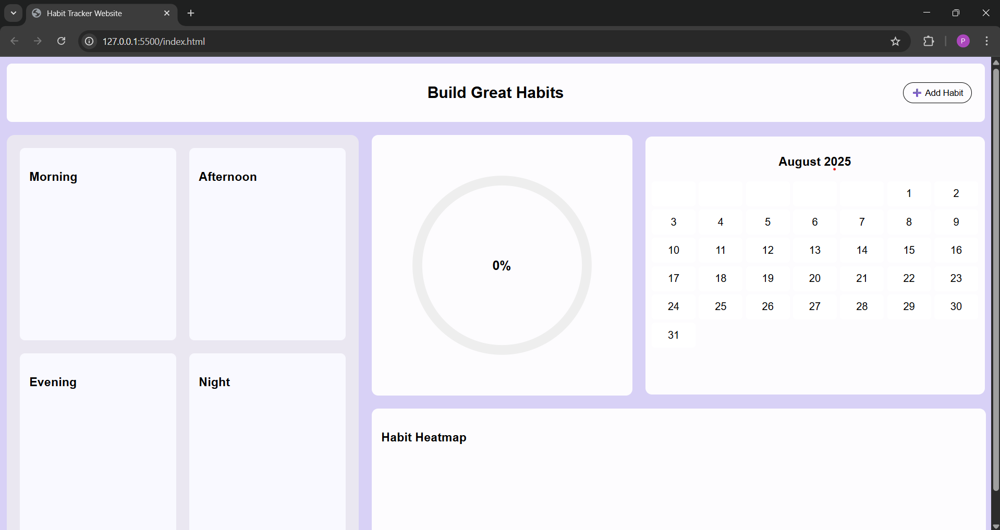
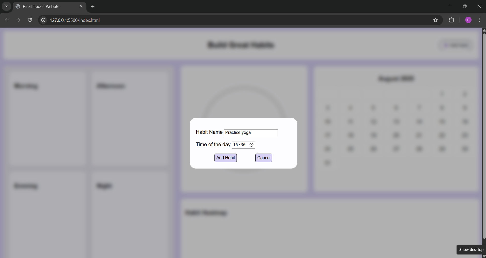
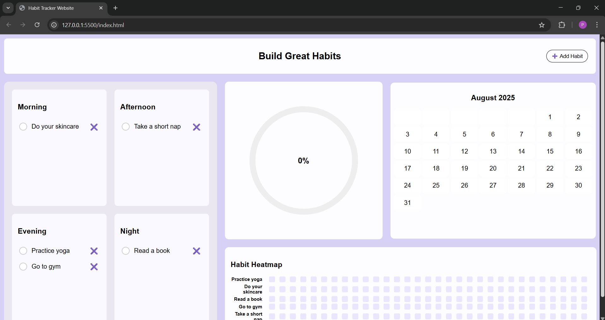
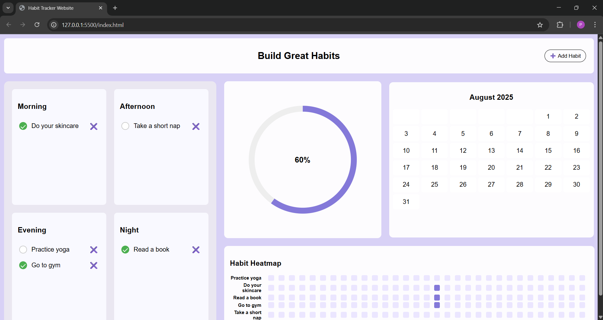
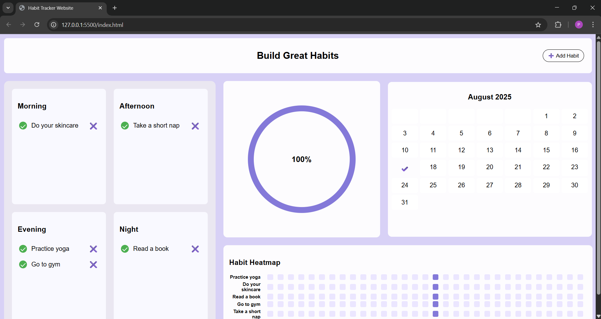

# habit-tracker-website

Track your daily habits easily and visualize your progress with an interactive calendar and heatmap.  

**Live Demo:** [View Website](https://puja-m6.github.io/habit-tracker-website/)

---

## Features

- Add habits for morning, afternoon, evening, or night.
- Mark habits as completed with checkboxes.
- View daily progress using a circular progress indicator.
- Calendar view shows which days all habits were completed.
- Habit heatmap shows completion status for each habit over the month.

---

## Screenshots

### Empty Habit Tracker

### Adding Habits

### Habits Added (Not Completed)

### Partially Completed Habits

### All Habits Completed

---

## Usage

1. Open `index.html` in your browser.  
2. Click **Add Habit** to create a new habit.  
3. Select the time of day for the habit.  
4. Mark habits as completed using checkboxes.  
5. Track progress on the circular progress indicator, calendar, and heatmap.

---

## Technologies Used

- HTML  
- CSS  
- JavaScript  

---

## Future Improvements

- **Persistent data:** Use local storage or a backend database so habits and progress persist across sessions.  
- **Edit habits:** Allow renaming or changing the time of an existing habit.  
- **Delete all habits:** Option to reset the tracker.  
- **Responsive design:** Ensure the website looks perfect on mobile and tablet screens.   

---

## License

This project is open for personal use and learning. No specific license applied.
